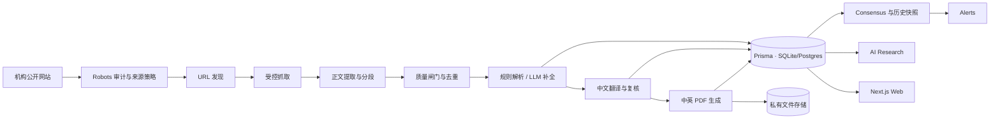

# Institutional Intelligence · 技术架构

> 文档状态：Draft v1 · 2026-08-27  
> 主线：**Research → Data → Consensus → Signal**

本文描述当前 MVP 的真实结构，以及下一阶段采集、解析和生产化的目标架构。凡标记为“当前”的内容已经存在；标记为“目标”的内容尚待实现。

## 1. 目标与非目标

### 目标

- 合规采集公开、无需登录的机构研究内容。
- 永久保存清洗后的英文原文，并生成可追溯、可重译的专业中文译文。
- 为每篇文章生成可下载的英文原文 PDF 和中文译文 PDF；来源自带 PDF 时永久保存原文件。
- 将文章转换为可追踪的资产观点：资产、方向、目标价、置信度和时间范围。
- 聚合为按机构权威性加权、随时间衰减的 Consensus。
- 支持研报浏览、资产与机构视图、AI Research、Watchlist 和 Alerts。
- 所有自动结果可追溯到机构官网原文。

### 当前非目标

- 不采集登录墙、付费墙或客户专属内容。
- 不绕过 CAPTCHA、人机验证、WAF 或其他访问控制。
- 不把模型生成内容伪装成机构原文；中英文全文与 PDF 通过统一权限管理器交付，并始终保留官网回链与来源标识。
- 不为 64 家机构预先建立 64 套独立爬虫。
- MVP 阶段不引入消息队列、微服务或分布式调度器。

## 2. 架构原则

1. **配置优先，适配器兜底**：通用流水线覆盖多数机构，只有结构异常的来源才写专属适配器。
2. **便宜且稳定的来源优先**：RSS → Sitemap → 静态 HTML → 页面公开数据 → Playwright。
3. **发现与解析分离**：找到 URL 不代表它是有效研报，必须经过抓取、正文提取和质量闸门。
4. **不确定结果不进入 Consensus**：资产方向冲突或证据不足时标记待复核，不写方向信号。
5. **原始内容与派生结果分离**：`rawText` 用于内部重解析；摘要、标签和方向均可按解析器版本重建。
6. **先保持单体**：Next.js、Prisma 和采集 CLI 共享类型与数据库；吞吐量证明有需要后再拆 Worker。

## 3. 系统上下文



## 4. 当前代码边界

| 模块 | 位置 | 职责 |
|---|---|---|
| Web 与 Server Actions | `src/app/` | 页面、登录态、Watchlist、Alerts 交互 |
| 查询层 | `src/lib/queries.ts`、`research.ts` | 页面查询和结构化问答 |
| Consensus | `src/lib/consensus.ts` | 权威加权、时间衰减、历史快照 |
| 合规规则 | `scripts/robots_audit.py`、`ingest/robots.ts` | 离线审计与运行时 URL 判断 |
| 发现与抓取 | `ingest/fetch.ts`、`probe.ts`、`run.ts` | 无副作用探测、RSS/Sitemap/HTML/PDF 入口、限速、调度 |
| 正文提取 | `ingest/extract.ts` | 清洗、正文识别、小标题分段、质量检查 |
| 结构化解析 | `ingest/parseLLM.ts` | 规则解析、可选 Anthropic 解析 |
| 落库与去重 | `ingest/store.ts`、`hash.ts` | 三重 hash 去重、事务化写入 |
| 数据模型 | `prisma/schema.prisma` | 机构、文章、分析、资产、共识和用户数据 |

目标新增两个共享模块：

- `src/lib/documents/`：PDF 下载、提取、生成、翻译排版和验证。
- `src/lib/permissions.ts`：页面、Server Actions、下载路由和 API 共用的权限判断。

当前运行方式是一个代码库、一个数据库、两类进程：

- `next dev/start`：Web、查询和 Server Actions。
- `npm run ingest/consensus`：人工或定时运行的短生命周期任务。

## 5. 采集架构

### 5.1 来源注册表

`data/institutions.json` 是机构基础信息与稳定入口（如 RSS）的源。通用提取不能表达的少量已验收差异固化在 `src/lib/ingest/sourceRules.ts`：额外列表入口、候选路径、正文拒绝条件和是否使用 sitemap。

- `rssUrl`、`sitemapUrl`
- `includePaths`、`excludePaths`
- `requiresRender`
- 可选的 `listingSelector`、`articleSelector`

这些字段通过 `prisma/seed.ts` 写入 `Institution`。站点验收只负责发现规则，生产调度只读取已提交的配置、通用解析器和 `sourceRules.ts`，不在每次运行时调用 LLM 或人工探站。每个新增例外必须同时提交回归测试；需要执行、点击或重写响应的站点才增加独立适配器。

### 5.2 URL 发现能力阶梯

每个机构按以下顺序尝试，某一层得到足够候选 URL 后停止：

1. RSS/Atom。
2. robots 中声明的 Sitemap 或配置的 Sitemap。
3. Sitemap Index 递归展开，并按研究路径与 `lastmod` 过滤。
4. 静态研究列表页链接提取。
5. 页面公开的 JSON-LD 或公开 JSON 数据。
6. Playwright 正常渲染研究列表页。

所有候选 URL 必须满足：同一机构域名、允许路径、非导航/营销路径，并在访问前经过 robots 判断。PDF 是允许的研究文档类型；xlsx、zip、可执行文件等其他下载默认拒绝。

### 5.3 Robots 与访问策略

`data/crawl_policy.json` 是离线审计结果，负责决定机构是否进入自动采集集合：

- `allowed`、`delayed`：允许进入运行时检查。
- `blocked`、`manual`：自动任务永不采集。

目标运行时策略：

- 每个 origin 在任务开始时读取一次 robots，并按 TTL 缓存。
- 明确命中 Disallow 时立即跳过 URL。
- 遵守 robots `Crawl-delay`、审计配置和至少 1 秒的礼貌间隔。
- robots 临时不可达时，只允许使用有效期内的 last-known-good 结果；无有效缓存则暂停该站。
- robots 规则、ToS 或访问状态变化后，离线审计结论可以降级，但不能自动把 `blocked/manual` 升级为可采集。

robots 允许是自动访问条件，不是全文转载授权。

### 5.4 抓取与渲染边界

普通抓取使用统一 User-Agent、超时、有限重试、指数退避，并尊重 `Retry-After`。后续支持 ETag 和 Last-Modified，减少无变化页面的流量。

HTML/XML/JSON 使用文本抓取器；PDF 使用独立的二进制下载器。PDF 下载器校验响应类型、文件签名、大小上限和 SHA-256，不把二进制内容传给 HTML 清洗器。

Playwright 仅用于正常呈现公开 JS 页面：

- 不使用 stealth 插件、代理轮换或验证码识别。
- 检测登录墙、付费墙、CAPTCHA、人机验证或 Access Denied 后停止该来源。
- Playwright 是静态抓取无法发现列表或正文时的公开页面兜底；每个候选仍先走静态抓取，且不会执行同意、登录或人机验证动作。

### 5.5 采集控制面与“数据中台”决策

当前不拆独立数据中台微服务。现有单体已经具备来源注册表、Prisma 事实库、`JobRun`、来源级状态、定时任务和结构化日志；此时再增加服务、队列和第二套部署会引入双写一致性、重试归属和运维成本，却不会提升受 robots/访问门限制的站点覆盖率。

控制面直接建立在现有后端内：

- `npm run ingest:probe`：对 59 个合规候选源做无副作用实时探测，输出 feed/sitemap/listing/PDF 数量、抽样通过数和失败分类。
- `Institution.lastCrawl*`：记录 `running/succeeded/empty/paused/refused/failed`，零候选不再伪装成成功。
- `JobRun`：记录一次全局任务的参数、尝试、耗时、结果指标和错误。
- `/admin`：复用单体认证、权限和 Prisma 事实库的运营界面；来源暂停与重试不会覆盖 robots 合规策略，并写入 `AuditLog`。
- `GET /api/health`：匿名调用只返回 `{ status }`（容器健康检查与外部探针够用）；数据库、存储、来源状态分布、24 小时内成功数、最近一次 ingest 结果与 Macro 同步状态仅对管理员会话或持 `HEALTH_DETAIL_TOKEN` 的调用返回，避免把内部运维细节和错误串暴露给公网。

`ingest:probe` 只用于首次接入、规则变更和故障验收，不能成为 scheduler 的发现依赖。正式采集默认把时间窗口硬限制在当月月初之后；历史内容不主动回溯，已入库正文永久积累。抓取只写英文事实源与 segments，结构化、翻译和 PDF 由 scheduler 后续独立命令处理，任何模型故障都不会阻塞采集。

只有在单轮采集超过调度周期、需要多机并发与分布式锁、采集与产品团队独立发布，或外部消费者需要稳定的数据事件接口时再拆 Worker/队列。届时上述模块边界可直接迁出，无需改前端事实模型。

### 5.6 正文提取

提取顺序：

1. JSON-LD 的 `headline`、`datePublished`、`author`、`articleBody`。
2. `<article>`、`itemprop=articleBody` 等语义容器。
3. 当前段落密度算法。
4. 来源配置中的专属 selector。

输出统一为：

```ts
interface ExtractedArticle {
  title: string;
  text: string;
  segments: { heading: string | null; text: string }[];
  author: string | null;
  publishedAt: Date | null;
}
```

正文不足、句子过少、菜单文本堆积或 JS 空壳由质量闸门拒绝，不进入解析器。

## 6. Segment-aware 结构化解析

### 6.1 候选资产

- 标题命中资产别名，或正文累计命中至少两次，才成为候选资产。
- 标题命中给予更高分，最多保留 4 个候选。
- ASCII 别名使用词边界；中文别名使用子串匹配。

### 6.2 有小标题的文章

- 判断上下文使用 `heading + text`，逐段识别资产和方向。
- 同一资产的非中性方向一致：写入该方向。
- 文章明确表达 neutral/hold/balanced：可以写入中性。
- 仅提到资产但没有方向证据：不把它推断为中性。
- 同一资产同时出现多空方向：加入 `unresolvedTickers`，不写 `ArticleAsset`。

### 6.3 无小标题的文章

- 单资产文章可以使用全文判断方向。
- 多资产文章只对标题命中或得分最高的主资产使用全文方向。
- 其他候选资产加入 `unresolvedTickers`，不进入 Consensus。

### 6.4 LLM 使用边界

- 规则解析始终先运行。
- 配置了可用 LLM Provider 且存在 unresolved 时，才调用真实 LLM 解析全文。
- LLM 输出必须经过 ticker 白名单、方向枚举、数值范围和 JSON schema 校验。
- 验证失败后保留规则结果，并标记 `needs_review`。
- 每次分析记录 `model`、`promptVersion` 和 `reviewStatus`。

### 6.5 多模型 Provider

解析和翻译共用统一 Provider 边界，业务代码不直接依赖某一家 SDK：

```ts
interface LLMProvider {
  parseArticle(input: ParseInput): Promise<ParsedArticle>;
  translateArticle(input: TranslationInput): Promise<TranslatedArticle>;
  reviewTranslation(input: TranslationReviewInput): Promise<TranslationReview>;
}
```

第一批支持 Anthropic 和 OpenAI，通过 `LLM_PROVIDER` 选择主 Provider；后续可增加 Gemini 等实现。所有 Provider 使用相同输入输出类型、schema 校验和质量闸门，不把供应商特有字段写入核心业务表。

## 7. 双语内容、PDF 与权限

### 7.1 内容边界

- `Article.rawText` 永久保存清洗后的英文原文，作为解析、审计和重处理的唯一事实来源。
- 中文译文是派生内容，独立保存并可按模型、提示词和术语库版本重新生成。
- 资产方向、目标价和 Consensus 只从英文原文产生，不能从中文译文反向生成或覆盖。
- 前端可展示完整中文译文和英文原文；正文展示、PDF 下载与未来 API 返回均通过统一权限管理器判断。

### 7.2 翻译数据模型

目标模型使用独立表，避免把多语言和版本字段堆进 Article：

```prisma
model ArticleTranslation {
  id              String   @id @default(cuid())
  articleId       String
  locale          String   // zh-CN
  title           String
  text            String
  provider        String
  model           String
  promptVersion   String
  glossaryVersion String
  status          String   // translated | reviewed | needs_review
  qualityScore    Float?
  translatedAt    DateTime @default(now())

  article         Article  @relation(fields: [articleId], references: [id], onDelete: Cascade)

  @@unique([articleId, locale])
}
```

MVP 每篇文章、每种语言只保留当前译文；版本信息用于判断是否需要重译。确有历史对比需求后再增加翻译版本表。

### 7.3 顶级金融中文翻译流程

翻译按文章段落和小标题进行，但每批请求同时提供标题、机构、资产和相邻段落上下文，避免逐句翻译造成术语和指代断裂：

1. 规范化原文结构，为标题和段落分配稳定 ID。
2. 注入版本化金融术语库、机构名和资产名词典。
3. 主模型生成忠实译文，不概括、不删减、不添加观点。
4. 程序化检查数字、货币、百分比、基点、日期、ticker 和段落是否完整对应。
5. 独立 Reviewer 对照中英文检查遗漏、误译、语气变化和术语不一致。
6. 未通过时根据错误清单修订一次；仍未通过则标记 `needs_review`。

高价值文章优先使用不同 Provider 执行翻译与复核，降低同一模型重复忽略错误的概率；普通文章可以由同一 Provider 使用独立提示词复核。

### 7.4 中文风格标准

- 使用专业、克制、清晰的机构研究语言，不写成新闻标题或营销文案。
- 严格保留 `may`、`could`、`likely`、`risk` 等不确定性，不把推测翻成结论。
- `overweight`、`duration`、`carry`、`spread`、`terminal rate`、`hawkish/dovish` 等按金融语境翻译，不按日常词义直译。
- 机构名称、产品名称、ticker、指数名称和评级保持统一。
- 数字、方向、单位和时间范围不得自行换算；需要币种换算时作为独立展示字段处理。
- 首次出现的必要英文术语可采用“中文（English）”，后文统一使用中文。

### 7.5 质量标准

每篇译文至少满足：

- 数字、货币、百分比、日期和 ticker 一致率 100%。
- 标题、小标题和有效段落无遗漏。
- 关键金融术语命中术语库。
- 多空方向、因果关系和不确定语气不改变。
- Reviewer 未发现严重事实错误后，状态才能进入 `reviewed`。

建立一组 30–50 篇覆盖宏观、利率、外汇、股票和商品的基准文章，由人工确认参考译法。更换模型、提示词或术语库时先跑基准集，再决定是否批量重译。

### 7.6 每篇文章的 PDF 资产

每篇成功入库的文章最终必须具备两个可下载文档：

- 英文原文 PDF。
- 中文译文 PDF。

两份 PDF 均永久保存；除管理员删除、来源撤回或后续策略调整外不自动过期。

根据来源分两条路径：

#### HTML 来源

1. 清洗正文永久写入 `Article.rawText`。
2. 使用统一机构研究模板生成英文 PDF。
3. 中文译文通过质量闸门后，使用相同模板和段落结构生成中文 PDF。
4. 两份 PDF 的封面、元数据和页脚记录机构、原文 URL、发布日期和生成时间。

HTML 来源不复制网站导航、Cookie 弹窗和营销组件，也不承诺复刻网站页面视觉；中英 PDF 使用本站统一、可审计的研究文档模板。

#### 原生 PDF 来源

1. 原始 PDF 字节不修改，永久保存为 source-original。
2. 从 PDF 提取英文正文和结构，写入数据库；扫描版先 OCR。
3. 按文本块和页面上下文翻译。
4. 在保持页面结构的基础上生成中文 PDF，原始 PDF 始终独立保留。

### 7.7 原生 PDF 的版式保真标准

“不改变原本布局”定义为：

- 页面尺寸、方向和页数保持不变。
- 图片、表格、图表、页眉页脚及主要文本块位置保持不变。
- 中文替换原文本框内容，允许在文本框内部调整字体、字号、行距和换行以避免溢出。
- 使用可嵌入的中文字体，禁止缺字、黑框、文字重叠或裁切。
- 图片中不可编辑的英文默认保留；能可靠识别且不破坏图表时才覆盖翻译标签。

这不是逐像素完全一致：中英文字宽和字体度量不同。目标是保持视觉层级和页面结构，而不是强行保持每一行完全相同。

已确认的验收优先级是：内容完整性与准确性 > 可读性 > 页面结构一致性 > 像素级视觉复刻。只要信息无遗漏、无误译、无裁切且阅读顺畅，可以调整中文字体、字号、行距和局部换行。

版式翻译流程：

1. 判断 born-digital 或 scanned PDF。
2. 提取文本块坐标、阅读顺序、字体信息、表格和图像区域。
3. 按章节上下文翻译，而不是孤立翻译每个文本框。
4. 将中文回填到对应区域，按限制范围内的字号和行距自动适配。
5. 每页渲染为 PNG，检查溢出、重叠、缺字、空白页和图表清晰度。
6. 对数字、页数、标题和段落进行程序化核对；失败则标记 `needs_review`，不开放下载。

### 7.8 文件存储与元数据

PDF 文件不写入数据库 BLOB。数据库只保存元数据和私有存储 key：

```prisma
model ArticleDocument {
  id          String   @id @default(cuid())
  articleId   String
  locale      String   // en | zh-CN
  kind        String   // source_original | rendered_original | translated
  storageKey  String   @unique
  sourceUrl   String?
  sha256      String
  mimeType    String   @default("application/pdf")
  byteSize    Int
  pageCount   Int?
  layoutMode  String   // source | standard | preserved
  status      String   // processing | ready | needs_review | failed
  createdAt   DateTime @default(now())

  article     Article  @relation(fields: [articleId], references: [id], onDelete: Cascade)

  @@unique([articleId, locale, kind])
}
```

MVP 使用配置的本地私有目录；生产环境可切换到 S3 兼容对象存储。业务代码只依赖 `DocumentStorage` 的 put/get/exists/signedDownloadUrl 接口。文件名和 storage key 使用内部 ID，不直接信任来源文件名。S3 下载在权限检查后签发 30–900 秒 URL，不暴露永久公共地址。

原始 PDF 以 SHA-256 保证字节级完整性；对外下载使用 `Content-Disposition: attachment`。上传存储前检查 PDF 签名、文件大小、加密状态、嵌入附件和潜在活动内容，原文件与用于解析的安全副本分离。

### 7.9 权限管理器

权限必须集中判断，不在各页面散落 tier 条件：

```ts
type Permission =
  | "article.summary.view"
  | "article.translation.view"
  | "article.pdf.original.download"
  | "article.pdf.translation.download"
  | "article.raw.read"
  | "article.bulk.export";

function can(user: User | null, permission: Permission): boolean;
```

页面、Server Actions、下载路由和未来 API 必须调用同一个权限管理器。对象存储保持私有，下载前先鉴权，再由服务端流式返回或签发短时效下载 URL；不能暴露永久公共地址。

`article.raw.read` 表示读取采集后的英文事实源。所有文章都必须生成可交付的原文 PDF；具体用户范围后续通过权限矩阵配置，页面和下载路由不得自行硬编码 tier。

核心功能阶段只实现统一权限入口和受控下载链路，不锁定 free/pro/trader/professional 的具体矩阵。产品功能稳定后再通过集中配置分配各 tier 权限，无需修改页面或下载逻辑。

### 7.10 生产运行边界

- 开发环境继续使用 SQLite；生产通过由主 schema 生成的 PostgreSQL schema 和受版本控制的初始迁移部署。
- Web、PostgreSQL 和单实例 scheduler 可由 Docker Compose 启动；`/api/health` 同时检查数据库与存储适配器。
- 每次采集写入 `JobRun`，记录参数、尝试次数、结果指标和错误；scheduler 提供有限重试、线性退避及可选失败 webhook。
- `User.role`（member/reviewer/admin）与商业 `tier` 分离；用户写操作进入 `AuditLog`。
- 邮箱直登只用于预览，生产默认关闭；正式数据库会话 OAuth 已支持 Microsoft Entra ID 与 Google，部署时通过环境变量选择其一。

## 8. 数据与一致性

### 8.1 文章写入

一篇文章的 Article、Analysis 和 ArticleAsset 在同一数据库事务中写入。关键字段：

- `Article.rawText`：永久保存的清洗英文正文，仅内部使用。
- `Analysis`：摘要、论据、数字、风险、模型和复核状态。
- `ArticleAsset`：只有可以承担 Consensus 含义的资产方向。
- `ArticleTranslation`：中文译文和完整质量元数据。
- `ArticleDocument`：中英 PDF 的存储位置、hash、版式模式和处理状态。

### 8.2 去重

按以下顺序拒绝重复：

1. canonical URL hash。
2. 标准化标题 hash。
3. 标准化正文 content hash。

同一 URL 的内容更新在 MVP 中不建立版本表；确有修订追踪需求后再增加 ArticleRevision。

### 8.3 重解析与重译

`npm run reparse` 默认只扫描 `rawText IS NOT NULL` 且缺少 Analysis 的文章；`npm run translate` 默认只扫描缺少中文译文的文章。`needs_review` 不会在每轮 scheduler 中无限消耗模型额度，需要人工确认后用 `--retry-review` 重试；`--all` 用于明确的全量版本升级。

- 缺少解析/翻译结果：进入默认队列。
- `needs_review`：保留并等待显式重试或人工复核。
- `model/promptVersion` 旧于当前版本：版本升级时用 `--all` 重建。

重解析只更新 Analysis 和 ArticleAsset，不修改来源正文。译文的 Provider、模型、提示词或术语库版本落后时，独立进入重译任务。开发数据库可丢弃，因此首次接通新链路后直接重建，不为旧数据编写一次性迁移逻辑。

### 8.4 Macro Intelligence 数据域

Macro Intelligence 与 Article ingest、ArticleAsset 和 Institutional Consensus 保持独立。当前数据层已建立：

- `MacroIndicator`：网站使用的 canonical indicator identity。
- `MacroSeriesSource`：provider series 到 canonical indicator 的映射与优先级。
- `MacroObservation`：Decimal-safe、append-only 的 period/vintage/revision observation。
- `MacroRelease` / `MacroReleaseValue`：scheduled/released time 与发布当时 actual/previous/consensus snapshot。
- `MacroPolicyDocument`：官方央行原文、content hash 和可选的结构化解析。
- `MacroSyncState`：provider/scope 级 cursor、conditional request 与同步状态。

SQLite 不支持 Prisma `Json`，因此 Macro metadata 和 parsed JSON 按项目现有惯例保存为 JSON string，并在领域边界校验。所有数值事实使用 Prisma `Decimal`；`period`、`scheduledAt`、`releasedAt`、`sourcePublishedAt`、`vintageAt` 和 `fetchedAt` 分开保存。旧 observation 不原地覆盖，同 source/period 的新值只追加为新 revision。

`data/macro/` 保存 canonical indicators、provider series mappings 和 release families。`src/lib/macro/` 已实现 registry validation、Decimal-safe normalization、UTC/timezone helper、SHA-256 raw hash、registry upsert 和 transaction 内的 append-only revision decision；相同值的后续抓取不制造虚假 revision，不同 provider 的 vintage 相互独立。

`src/lib/macro/providers/` 已接入 BLS、BEA、FRED、EIA、Eurostat 与 ECB。adapter 共用 timeout、有限重试、provider 级限速、统一 User-Agent 和 secret-safe structured error；SDMX provider 使用同等的 CSV 边界。`fetch` 可注入，测试只读取裁剪后的官方响应 fixture。BLS key 可选，BEA/FRED/EIA key 来自环境变量，Eurostat/ECB 使用公开官方接口。映射参数保存在 registry，不散落在 adapter。`npm run macro:sync -- --provider=<name>` 或 `--all` 会同步 registry、规范化 observation，并通过 append-only 存储幂等落库和记录 `JobRun`。

`src/lib/macro/calendar.ts` 建立 release-centric Economic Calendar。优先读取 BLS iCal、BEA release schedule、Federal Reserve FOMC calendar 和 EIA WPSR holiday schedule；官方来源缺失时可用 FRED release dates，手工候选只作为最后 fallback。release identity 与 `scheduledAt` 分离，因此官方改期更新原记录而不制造重复；同步缺失不会自动取消既有事件。所有时间按来源 `America/New_York` 解释并以 UTC 落库，family registry 同时保存 importance 与 watcher polling strategy。

完整领域决策见 `docs/adr/ADR-macro-intelligence.md`。Release watcher、独立 Macro scheduler、历史回填、审计、告警与 `/macro` Web 查询均已接入；它们仍不写入 Article 或 Institutional Consensus 数据域。

## 9. Consensus 与信号

当前算法保留：

```text
raw   = Σ(authorityWeight × timeDecay × direction) / Σ(authorityWeight × timeDecay)
score = (raw + 2) / 4 × 100
```

- 展示优先使用滚动最近 24 小时内发布的研报观点；若某资产该窗口无数据，回退到该资产最近有数据的 24 小时窗口，并显示截至日期。
- Alerts 与 `ConsensusHistory` 仍严格只使用真实最近 24 小时；回退数据不触发新提醒，也不写成当日快照。
- 每个机构对同一资产只保留最新观点。
- `direction ∈ {-2,-1,0,1,2}`。
- 24 小时窗口内仍使用 `exp(-ageDays/31)` 做轻微时效加权。
- 快照写入 `ConsensusHistory`，驱动趋势和 Alerts。

解析为 unresolved 的资产不写 `ArticleAsset`，因此不会污染 Consensus。

## 10. 产品读取路径

- 公开上线由 `src/lib/publication.ts` 统一控制：完整英文正文与英文 PDF 就绪后即可阅读。
- 已复核中文译文与中文 PDF 就绪时优先显示中文；否则中文模式直接展示完整英文原文，不显示“待处理”占位。
- 页面通过 Prisma 查询层读取结构化数据，不直接读取网站；中文页面读取通过质量闸门的 ArticleTranslation。
- 中英 PDF 下载统一经过权限管理器，只有 `status = ready` 的文档可以交付。
- AI Research 先用确定性意图路由检索数据库证据，再选择性调用 LLM 汇总。
- LLM 只能使用检索到的证据，不执行开放式 Web 搜索。
- Watchlist 和 Alerts 使用 Server Actions；当前签名 Cookie 鉴权仅适用于 MVP。

## 11. 可观测性与失败恢复

MVP 先使用结构化任务日志，每个来源至少输出：

- 发现 URL 数量
- robots 拒绝数量
- 抓取成功/失败数量
- created、duplicate、empty 数量
- 最近错误类别和耗时

每次后台任务写入 `JobRun`，每个 Institution 保存最近尝试、状态、说明和最近成功时间。当前不建立逐 URL 的复杂任务表；只有排障与吞吐压力证明必要时再增加。

失败应隔离到单个机构或 URL，不能中断全部机构任务。重复执行必须保持幂等。

## 12. 测试策略

使用现有 `tsx` 和 Node 内置测试运行器，不新增测试框架。优先覆盖纯函数：

- robots 分组、最长匹配、通配符和 Crawl-delay。
- URL canonicalization 和三重去重。
- 正文清洗、分段和 junk gate。
- Segment-aware 多资产方向冲突。
- 翻译的数字/ticker 完整性、段落对应和术语库匹配。
- PDF 下载、hash、页数、字体、溢出和中英文档状态。
- 权限矩阵以及下载路由不能绕过权限管理器。
- Consensus 数学和“每机构只取最新观点”。
- AI Research 意图识别。

真实站点 HTML 只保留少量脱敏、裁剪后的测试 fixture，避免把完整第三方正文提交到仓库。

## 13. 部署演进

### 当前

- Next.js 单体应用。
- Prisma + SQLite：`prisma/dev.db`。
- 采集、Consensus 和 Alerts 由 CLI 手动运行。

### 下一阶段

- 定时任务调用现有 CLI，不先引入队列。
- 数据库切换 PostgreSQL；需要语义检索时再启用 pgvector。
- 采集任务与 Web 使用相同代码镜像、不同启动命令。

### 出现明确压力后

- 采集任务拆为独立 Worker。
- 只有当单机调度无法满足吞吐、重试或隔离要求时才引入队列。
- 真实 OAuth 凭据和 tier 权限矩阵在公开部署或计费接入前配置。

## 14. 实施顺序

1. 完成 Segment-aware 解析、`rawText`/segments 传递和最小测试。
2. 增加 Anthropic/OpenAI Provider、ArticleTranslation、术语库和翻译质量闸门。
3. 增加 ArticleDocument、私有文件存储、统一 PDF 模板和权限管理器。
4. 重建开发数据库，重新 seed 并抓取代表性 HTML/PDF 文章，建立首批翻译基准集。
5. 实现原生 PDF 文本提取、版式翻译、逐页渲染验证和下载。
6. 实现 Sitemap/Sitemap Index 发现和来源配置。
7. 增加 robots 缓存、last-known-good 和来源级结构化日志。
8. 为确实需要渲染的来源加入 Playwright。
9. 实现按解析器、模型、提示词和术语库版本重解析/重译/重建 PDF。
10. 接通有授权的生产价格源，运行 Forecast Accuracy 结算并校准 Institution Score。

## 15. 已确认与待确认

### 已确认

- 当前开发数据可以丢弃。
- 只采集公开、无需登录的内容。
- 预审 robots 结果用于建立采集策略，采集仍按规则限速和判断 URL。
- 技术手段可以解决 JS 渲染和页面结构差异，但不绕过访问控制。
- 下一主线是 Segment-aware 解析，然后是 Sitemap 发现。
- 永久保存清洗后的英文原文和中文译文，后续再讨论保留策略。
- LLM 层支持多模型供应商，第一批实现 Anthropic 和 OpenAI。
- robots last-known-good 有效期采用 24 小时。
- 所有通过质量闸门的文章都保存中英数据库版本和中英 PDF 文件版本。
- 来源自带 PDF 时永久保存原文件，并生成保持页面结构的中文 PDF。
- 每篇文章必须存在可下载的英文原文 PDF；实际下载资格由权限管理器决定。
- PDF 不要求逐像素复刻，以内容完整、翻译准确、完整可读和主要版式结构一致为验收标准。
- 当前阶段优先实现核心采集、解析、翻译和 PDF 能力；具体 tier 权限矩阵后续确定。

### 延后决策

- 各用户 tier 对中文全文、中英 PDF 下载、批量导出和 API 的具体权限矩阵。
- 最终部署平台尚未确定，不阻塞当前采集和解析开发。

## 16. 管理后台

`/admin` 由统一 layout 完成登录与 `admin.access` 鉴权，并按角色权限生成侧栏。管理员可管理账户、来源、任务、审核、API 密钥和审计日志；reviewer 仅能进入审核及只读分析页面。`ADMIN_EMAILS` 始终提供 admin 保底权限，避免数据库角色误操作锁死后台。

所有后台写操作使用 Server Action，在服务端再次校验对应的 `admin.*` 权限并调用 `writeAudit()`。账户封禁会删除数据库会话并让后续登录失败；强制下线通过推进 `passwordChangedAt` 和删除 Session 使现有登录失效。后台页面统一动态渲染、禁止索引，并由 middleware 加上 private/no-store 响应头。

## 17. 访问与 API 分析管线

页面客户端以 `sendBeacon` 向 `/api/analytics` 上报浏览、停留时间、业务事件和 Web Vitals。服务端先执行同源、DNT、机器人和限流检查，再异步写入原始表。访客 ID 使用 `AUTH_SECRET + UTC 日期 + IP + UA` 的 SHA-256 摘要；原始 IP 与分析 Cookie 均不保存，因此访客只能在单个 UTC 日内去重。

`analytics-rollup` 将最近三天原始浏览汇总到 `TrafficDaily`，并按 `ANALYTICS_RAW_RETENTION_DAYS` 清理原始数据；重复运行是幂等的。后台查询历史区间时优先读取日聚合，当日和实时指标读取原始记录。

公共 API 不保存逐请求日志。`withApiKey()` 在成功、鉴权失败、参数错误和服务端错误路径上记录端点、状态码与耗时，先合并进进程内缓冲，再批量 upsert 到 `ApiUsageDaily`。这让管理页能按日期、密钥、端点及状态码观察用量，而不会把数据库写入放进每次 API 请求的关键路径。
