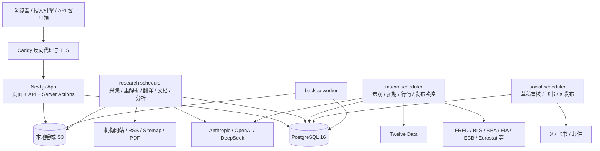
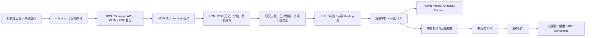

# TS001：Tline 技术架构与项目路径扫描

> **⚠️ 已归档（2026-09-27）。这是 2026-09-20 的快照，不是当前状态。** 最新全量扫描见
> [`20260927.md`](./20260927.md)。已知过时点：§11 CD 仍描述 GHCR 推送 + SSH（现为宿主机构建、
> self-hosted runner、无 SSH）；此后新增了分类门禁、JEV 可观测性、自定义看板与下架（`withdrawnAt`）
> 四组迁移。

> 扫描日期：2026-09-20  
> 项目根目录：`E:\Codes\Tline`  
> Git 基线：`main` / `3731120`  
> 项目包名：`institutional-intelligence@0.1.0`

## 1. 架构结论

Tline 是一个以 **Next.js 15 + React 19 + TypeScript + Prisma** 为核心的模块化单体应用，面向机构研报、宏观数据、市场行情、预期与社交发布。Web、API、Server Actions、数据采集和后台任务共用同一代码库与 Docker 镜像，但在生产环境中以不同进程运行。

当前形态可以概括为：

- Web 层：Next.js App Router，承担页面、Route Handler、Server Actions、SEO 和双语路由。
- 业务层：`src/lib/` 下按研报采集、宏观、LLM、文档、翻译、社交、分析等领域分组。
- 数据层：Prisma ORM；本地开发使用 SQLite，生产使用 PostgreSQL 16。
- Worker 层：研报、宏观、社交三个独立调度器，另有每日备份进程。
- 文件层：本地私有卷或兼容 S3 的对象存储，用于 PDF 和其他私有文档。
- 部署层：Docker Compose + Caddy + GitHub Actions + GHCR + VPS。

这不是微服务架构。它是“共享代码、共享数据库、按职责拆进程”的模块化单体，尚未引入消息队列。

## 2. 运行时拓扑



生产 Compose 服务：

| 服务 | 启动入口 | 职责 |
|---|---|---|
| `db` | PostgreSQL 16 | 主数据存储 |
| `app` | `npm start` | Next.js Web、API、Server Actions |
| `scheduler` | `npm run scheduler` | 研报采集、内容处理、分析汇总和日报 |
| `macro-scheduler` | `npm run macro:scheduler` | 宏观日历、观测、修订、预期、行情和告警 |
| `social-scheduler` | `npm run social:scheduler` | 社交草稿与发布循环 |
| `backup` | `npm run backup` | PostgreSQL 与文档每日备份 |
| `caddy` | 独立代理 Compose | TLS、域名入口、反向代理 |

## 3. 技术栈

| 类别 | 当前技术 |
|---|---|
| 语言 | TypeScript 5.6、少量 JavaScript/Python/Shell |
| Web | Next.js 15.5 App Router、React 19.2、React DOM 19.2 |
| 构建与运行 | Node.js 22、Turbopack（开发）、Next production build |
| 数据访问 | Prisma 5.22 |
| 数据库 | SQLite（本地模型源）、PostgreSQL 16（生产） |
| 认证 | Auth.js / NextAuth v4、Prisma Adapter、Azure AD、Google、Email、Credentials |
| HTML/RSS | Cheerio、rss-parser |
| 动态页面抓取 | Playwright Core + Chromium |
| PDF | pdfjs-dist、pdf-lib、PDFKit、fontkit |
| 文件存储 | 本地文件系统或 S3 兼容存储 |
| 邮件 | Nodemailer |
| LLM | Anthropic、OpenAI、DeepSeek 的自定义 Provider 边界 |
| 测试 | Node 内置 test runner，经 `tsx --test` 执行 |
| 代码质量 | TypeScript strict、ESLint 9、Next ESLint 配置 |
| 容器 | Docker、Docker Compose |
| CI/CD | GitHub Actions、GHCR、SSH 部署到 VPS |
| 反向代理 | Caddy 2 |

TypeScript 使用 `@/* -> ./src/*` 路径别名，目标为 ES2021，开启 `strict`、`noEmit`、`isolatedModules` 和增量编译。

## 4. 项目路径总览

```text
E:\Codes\Tline\
├─ src\
│  ├─ app\                  Next.js 页面、Route Handler、Server Actions、UI
│  ├─ lib\                  领域逻辑、数据访问、集成和后台任务能力
│  ├─ middleware.ts         双语 URL、重定向、缓存策略
│  ├─ instrumentation.ts    可选的搜索索引预热
│  └─ types\                类型扩展
├─ prisma\
│  ├─ schema.prisma         SQLite 开发模型，也是模型源文件
│  ├─ postgresql\           生成的 PostgreSQL schema 与生产迁移
│  └─ *.ts                  seed、迁移/修复、翻译、预测和文档 CLI
├─ scripts\                调度器、备份、审计、同步和运维 CLI
├─ data\                   机构、合规、宏观注册表和静态数据
├─ public\                 PWA/静态资源及自托管 pdf.js 资源
├─ storage\                默认本地私有文档存储目录
├─ docs\                   API、管理、宏观方法与 ADR 文档
├─ deploy\                 VPS 引导、Caddy 与备份配置
├─ .github\workflows\      CI、部署和运维工作流
├─ Dockerfile              Node 22 应用镜像、Chromium、字体、pg_dump 16
├─ docker-compose.yml      基础服务定义
├─ docker-compose.prod.yml 生产覆盖、镜像、资源限制、备份和日志策略
├─ next.config.mjs         Next.js、安全响应头和构建目录配置
├─ tsconfig.json           TypeScript 配置
├─ package.json            依赖与命令入口
├─ README.md               项目说明；部分路由描述已落后于源码
├─ ARCHITECTURE.md         详细设计文档；部分“当前状态”章节已落后
└─ DEPLOYMENT.md           部署和运维说明
```

扫描规模：

| 指标 | 数量 |
|---|---:|
| `src/` 中 TS/TSX/CSS 文件 | 332 |
| `*.test.ts` | 88 |
| App Router 页面模块 | 36 |
| Route Handler 模块 | 20 |
| Prisma 模型 | 58 |
| PostgreSQL 迁移目录 | 33 |
| `scripts/` 运维/调度脚本 | 34 |

## 5. 源码模块地图

### 5.1 Web 与交互层：`src/app/`

| 路径 | 作用 |
|---|---|
| `src/app/layout.tsx` | 根布局与全局页面框架 |
| `src/app/page.tsx` | 首页 |
| `src/app/research/` | 研报列表与详情 |
| `src/app/institution/`、`institutions/` | 机构详情、机构列表、准确率 |
| `src/app/markets/`、`asset/` | 市场与资产页面；旧 `/asset` 路径由中间件重定向 |
| `src/app/macro/` | 宏观首页、日历、指标和发布详情 |
| `src/app/topics/`、`market-themes/` | 主题与市场主题 |
| `src/app/watchlist/`、`alerts/` | 监控中心与历史兼容入口 |
| `src/app/signin/`、`account/` | 登录与账户设置 |
| `src/app/admin/` | 用户、数据源、模型、社交、分析、审计与任务后台 |
| `src/app/api/` | 内部 API、公开 API、认证、健康检查和社交回调 |
| `src/app/_components/` | 共享展示和交互组件 |
| `src/app/actions.ts` | Watchlist、告警和会话相关 Server Actions |

页面 URL 使用显式语言前缀：`/en/...` 与 `/zh/...`。源码没有复制两套路由，`src/middleware.ts` 将带语言前缀的 URL rewrite 到同一 App Router 页面，并通过请求头传递原始路径。无语言前缀时按 Cookie 或 `Accept-Language` 进行 308 跳转。

### 5.2 核心业务层：`src/lib/`

| 路径 | 主要职责 |
|---|---|
| `src/lib/db.ts` | PrismaClient 单例 |
| `src/lib/queries.ts` | 首页、资产、机构、研报等聚合查询 |
| `src/lib/ingest/` | 研报发现、robots、抓取、渲染、提取、解析、去重和落库 |
| `src/lib/macro/` | 宏观注册表、观测、发布、修订、预期、信号与审计 |
| `src/lib/macro/providers/` | BEA、BLS、ECB、EIA、Eurostat、FOMC、FRED、WPSR 等适配器 |
| `src/lib/macro/market/` | 市场标的、Twelve Data、质量、授权和同步 |
| `src/lib/macro/consensus/` | 宏观共识源、映射和同步 |
| `src/lib/macro/policy/` | 政策文档获取与提取 |
| `src/lib/macro/analysis/` | 宏观分析事实、守卫和 playbook |
| `src/lib/llm/` | Provider、任务路由、预算、价格、调用量记录 |
| `src/lib/documents/` | 原生 PDF 提取、生成、安全检查、Local/S3 存储 |
| `src/lib/translation/` | 翻译、标题日期与质量规则 |
| `src/lib/social/` | X、飞书、社交内容、审核与发布管线 |
| `src/lib/analytics/` | 页面事件、身份、查询、日汇总和 Agent |
| `src/lib/auth*.ts` | Auth.js 配置、会话与后备签名 Cookie |
| `src/lib/permissions.ts` | member/reviewer/admin 权限判断 |
| `src/lib/publication.ts` | 研报公开与语言版本就绪条件 |
| `src/lib/alerts.ts`、`alertDelivery.ts` | 告警规则计算与投递 |
| `src/lib/consensus.ts` | 机构观点共识与历史快照 |
| `src/lib/search.ts` | 站内搜索索引与查询 |
| `src/lib/jobs.ts`、`pipelineHealth.ts` | 任务状态、运行记录与健康度 |

### 5.3 数据、调度与运维

| 路径 | 主要职责 |
|---|---|
| `prisma/schema.prisma` | 统一业务模型；开发 datasource 为 SQLite |
| `scripts/generate-postgres-schema.mjs` | 将 datasource 改为 PostgreSQL，生成生产 schema |
| `prisma/postgresql/migrations/` | 生产迁移历史 |
| `prisma/seed.ts` | 初始数据 |
| `scripts/scheduler.mjs` | 研报 Worker 主循环 |
| `scripts/macro-scheduler.mjs` | 宏观/市场 Worker 主循环 |
| `scripts/social-scheduler.ts` | 社交 Worker 主循环 |
| `scripts/backup.mjs` | 数据库和文档备份/验证 |
| `scripts/validate-env.mjs` | 启动前环境校验 |
| `scripts/check-worker-health.mjs` | Worker 心跳健康检查 |
| `data/institutions.json` | 机构来源注册表 |
| `data/crawl_policy.json` | 爬虫访问策略 |
| `data/macro/` | 宏观指标、来源、发布族与分析 playbook |

## 6. 关键业务链路

### 6.1 Web 请求链路

```text
请求
  → Caddy
  → Next middleware（语言、旧路径、缓存策略）
  → App Router 页面 / Route Handler / Server Action
  → 权限与发布状态检查
  → Prisma 查询或文件存储
  → HTML / RSC / JSON / PDF
```

`next.config.mjs` 统一设置 CSP、HSTS（生产）、X-Frame-Options、Referrer-Policy、Permissions-Policy 等安全头。公开匿名 GET 可进入短期共享缓存；带会话或私有路径使用 `private, no-store`。

### 6.2 机构研报链路



主要入口是 `src/lib/ingest/run.ts`。抓取层包含私网地址阻断、响应大小限制、超时、文本缓存、robots 检查、请求间隔和单来源失败隔离。动态页面使用 Playwright/Chromium；计划抓取不使用 LLM 探索站点。

研报 Worker 同时运行四类循环：

1. 采集：按到期来源执行 `ingest --all --due`，支持重试和失败 Webhook。
2. 内容处理：人工重试、重解析、翻译、文档生成、watchdog。
3. 分析汇总：访问分析 rollup 与原始记录清理。
4. 日报：按 Asia/Shanghai 时区执行每日汇报。

### 6.3 宏观与市场链路

```text
宏观注册表
  → Provider 适配器同步观测
  → 归一化与质量检查
  → MacroObservation / MacroRelease / MacroExpectation
  → 发布值冻结与 surprise 计算
  → 分析、信号、告警、社交草稿和页面

Twelve Data
  → MarketInstrumentSource 映射
  → Provider 预算预留
  → MarketObservation
  → 授权/质量/新鲜度检查
  → PriceObservation 兼容桥、资产页与预测结算
```

宏观 Worker 独立调度日历、预期、Provider 同步、发布监控、修订、政策、行情和告警。任务状态通过 `JobRun`，进程存活与进度通过 `WorkerHeartbeat` 记录。

### 6.4 LLM 链路

`src/lib/llm/` 提供任务级路由，而不是在业务代码中直接绑定单一模型：

```text
业务任务
  → LlmTaskRoute
  → 预算检查
  → Provider/模型解析
  → Anthropic / OpenAI / DeepSeek
  → JSON/文本校验
  → LlmCall 用量与成本记录
```

没有可用密钥或任务被禁用时，部分研报处理可退回确定性规则解析。LLM 配置、路由、单价和预算可由管理后台维护，密钥经 `src/lib/secrets.ts` 处理。

### 6.5 社交发布链路

```text
可发布内容
  → SocialDraft
  → 自动或人工审批
  → SocialRoute
  → SocialDelivery
  → X 发布 / 飞书审核与通知
```

社交 Worker 会恢复中断状态、更新心跳，并以幂等状态记录成功、部分成功或失败。OAuth 连接和回调位于 `src/app/api/social/x/`，飞书回调位于 `src/app/api/social/feishu/`。

## 7. 数据模型分区

58 个 Prisma 模型可按领域归类：

| 数据域 | 代表模型 |
|---|---|
| 机构与研报 | `Institution`、`Article`、`ArticleSegment`、`ArticleFigure` |
| 结构化分析 | `Analysis`、`AtomicView`、`Asset`、`ArticleAsset` |
| 翻译与文档 | `ArticleTranslation`、`ArticleTranslationSegment`、`ArticleDocument`、`ContentRetry` |
| 预测与价格 | `Forecast`、`PriceObservation`、`ConsensusHistory` |
| 宏观 | `MacroIndicator`、`MacroSeriesSource`、`MacroObservation`、`MacroRelease`、`MacroForecast`、`MacroReleaseValue`、`MacroExpectation`、`MacroPolicyDocument`、`MacroSignalSnapshot` |
| 市场数据 | `MarketInstrument`、`MarketInstrumentSource`、`MarketObservation`、`DataLicensePolicy`、`ProviderUsage` |
| 社交 | `SocialDraft`、`SocialSetting`、`SocialAccount`、`SocialPlatformCredential`、`SocialRoute`、`SocialDelivery` |
| 用户与认证 | `User`、`Account`、`Session`、`VerificationToken` |
| 监控与告警 | `WatchlistItem`、`AlertRule`、`AlertEvent` |
| 运维与审计 | `AuditLog`、`JobRun`、`WorkerHeartbeat`、`ApiKey` |
| 访问分析 | `PageView`、`AnalyticsEvent`、`WebVital`、`TrafficDaily`、`ApiUsageDaily` |
| LLM 控制面 | `LlmProvider`、`LlmTaskRoute`、`LlmModelPrice`、`LlmCall`、`LlmBudget` |
| 主题快照 | `TradingThemeSnapshot` |

需要注意：`prisma/schema.prisma` 是模型源文件，但 datasource 为 SQLite；Docker 构建和生产迁移前通过 `scripts/generate-postgres-schema.mjs` 生成 `prisma/postgresql/schema.prisma`。生产迁移只应针对生成后的 PostgreSQL schema 执行。

## 8. 页面与 API 路径

### 8.1 主要页面

- `/en`、`/zh`：首页。
- `/[locale]/research`、`/research/[id]`：研报列表与详情。
- `/[locale]/institutions`、`/institution/[slug]`：机构列表与详情。
- `/[locale]/markets`、`/markets/[ticker]`：市场和资产详情。
- `/[locale]/macro`、`/macro/calendar`、`/macro/indicator/[key]`、`/macro/release/[id]`：宏观数据。
- `/[locale]/topics`、`/topics/[topic]`、`/market-themes`：主题页。
- `/[locale]/watchlist`：登录用户的统一监控中心。
- `/admin/**`：运营、用户、API Key、模型、社交和分析后台。

`/consensus` 与 `/search` 已退役，由中间件重定向到对应语言的 `/research`。`/asset/[ticker]` 是兼容旧链接的路径，会重定向到当前资产路径。

### 8.2 Route Handlers

| 路径 | 用途 |
|---|---|
| `/api/v1/research` | API Key 保护的研报列表 |
| `/api/v1/research/[id]` | API Key 保护的研报详情 |
| `/api/v1/institutions` | API Key 保护的机构列表 |
| `/api/auth/[...nextauth]` | Auth.js |
| `/api/search` | 站内搜索 |
| `/api/feed/pulse` | 首页/Feed 增量状态 |
| `/api/documents/[id]` | 权限控制的文档读取 |
| `/api/figures/[id]` | 研报图表读取 |
| `/api/analytics` | 访问分析事件采集 |
| `/api/health` | 应用与依赖健康检查 |
| `/api/og` | Open Graph 图片 |
| `/api/social/x/connect`、`callback` | X OAuth |
| `/api/social/feishu` | 飞书回调 |
| `/rss.xml`、`/feed.xml` | 订阅输出 |
| `/sitemap.xml`、`/sitemap/[shard]` | Sitemap 索引和分片 |
| `/llms.txt`、`/llms-full.txt` | 机器可读站点说明 |

## 9. 认证、授权与安全边界

- 正式认证由 Auth.js + Prisma Adapter 提供，可选择 Azure AD、Google 或 Email；另有密码 Credentials 和显式开关控制的本地 Demo 登录。
- 角色层级为 `member < reviewer < admin`，共享权限判断位于 `src/lib/permissions.ts`。
- API Key 使用 scope 和使用量记录，公开 v1 API 目前实际实现 `research` 与 `institutions`。
- 文档读取通过受控 Route Handler，不直接暴露私有存储路径。
- 抓取入口在发出请求前校验公网 HTTP(S) URL，阻断 localhost、元数据地址和私网 IP，降低 SSRF 风险。
- CSP 默认只允许同源；生产启用 HSTS；API 响应附加 `X-Robots-Tag: noindex, nofollow`。
- 数据授权策略默认拒绝，市场数据在进入公开展示、结算或内部分析前检查用途、质量和新鲜度。
- 审计、任务运行、Worker 心跳和健康检查均持久化或结构化输出。

## 10. 配置与外部依赖

配置通过环境变量注入，`.env.example` 与 Compose 文件是主要入口。不要把 `.env` 提交或写入文档。

| 配置组 | 代表变量/用途 |
|---|---|
| 数据库 | `DATABASE_URL`、`POSTGRES_PASSWORD` |
| 站点与认证 | `SITE_URL`、`NEXTAUTH_URL`、`AUTH_SECRET`、`AUTH_PROVIDER`、OAuth/Email 配置 |
| 文件存储 | `DOCUMENT_STORAGE_DRIVER`、`DOCUMENT_STORAGE_ROOT`、`S3_*`、AWS 凭据 |
| LLM | `ANTHROPIC_API_KEY`、`OPENAI_API_KEY`、`DEEPSEEK_API_KEY` |
| 研报任务 | `INGEST_*`、`REPARSE_*`、`TRANSLATION_*`、`JOB_*` |
| 宏观 | `FRED_API_KEY`、`BLS_API_KEY`、`BEA_API_KEY`、`EIA_API_KEY`、`MACRO_*` |
| 行情 | `TWELVE_DATA_API_KEY`、`TWELVE_DATA_QUALITY` |
| 社交 | `X_*`、`FEISHU_*`、`SOCIAL_*` |
| 分析与搜索 | `ANALYTICS_*`、`SEARCH_INDEX_MAX_ARTICLES`、`SEARCH_PREWARM` |
| 运维 | `HEALTH_DETAIL_TOKEN`、`BACKUP_*`、Worker 心跳和告警 Webhook |

## 11. 构建、测试与部署

### 本地常用命令

```bash
npm ci
npx prisma generate
npm run setup
npm run dev
npm test
npm run typecheck
npm run lint
npm run build
```

### CI

`.github/workflows/ci.yml` 在 Pull Request 和可复用调用中执行：

1. `npm ci`
2. `prisma generate`
3. 建立临时 SQLite 数据库
4. TypeScript 检查
5. ESLint
6. 单元测试
7. Next.js 生产构建

### CD

`main` 分支推送触发：

1. 复用完整 CI。
2. 构建 Docker 镜像并推送到 GHCR，标签包含提交 SHA。
3. 通过 SSH 上传 Compose 文件并在 VPS 拉取镜像。
4. 等待 App、研报 Worker、宏观 Worker、社交 Worker 健康。
5. 成功后记录部署标签并保留有限回滚镜像；失败时回滚到上次成功标签。

镜像包含 Chromium、中日韩字体、Liberation 字体和 PostgreSQL 16 `pg_dump`，以非 root `node` 用户运行。启动时先校验生产环境、执行数据库迁移，再启动 Next.js。

## 12. 当前架构特征与注意事项

### 已形成的优点

- 同一领域代码集中，研报、宏观、LLM、社交等边界已清晰。
- Web 与 Worker 共用类型、模型和业务规则，避免重复实现。
- 调度器按业务拆进程，单个宏观或社交循环不会直接阻塞 Web。
- 抓取合规、SSRF 防护、数据授权、发布闸门和审计均有明确代码边界。
- LLM 具备 Provider 路由、预算、价格和用量记录，不是散落的直接 API 调用。
- CI 覆盖类型、Lint、测试和生产构建；部署具备健康门禁与回滚。

### 需要维护者特别留意

1. **文档状态存在漂移。** `ARCHITECTURE.md` 的“当前”章节仍描述 SQLite 与手工 CLI，但生产代码已经是 PostgreSQL + 多 Worker；README 仍提到已退役的 `/consensus`。判断现状应以源码、Compose 与迁移为准。
2. **开发/生产 schema 双轨。** PostgreSQL schema 是由 SQLite 源 schema 机械生成，模型修改后必须重新生成并检查生产迁移。
3. **所有进程共享数据库。** 当前通过数据库状态、锁、`JobRun` 和 `WorkerHeartbeat` 协调，没有消息队列；扩容时需继续保证幂等与并发安全。
4. **单镜像职责较多。** 好处是部署简单，代价是 Web、抓取、PDF、浏览器和 Worker 依赖共同增大镜像体积。
5. **外部集成较多。** 机构站点、宏观 Provider、行情、LLM、Email、X、飞书和 S3 的失败必须保持局部隔离；现有代码已采用任务重试与心跳，应避免绕过这些入口。
6. **根目录含构建产物和临时目录。** `.next*`、`.preview`、`tmp`、`node_modules` 不属于架构源码；扫描和审查时应排除。

## 13. 快速定位索引

| 要找什么 | 首选路径 |
|---|---|
| 页面或 URL | `src/app/`、`src/middleware.ts` |
| 数据查询 | `src/lib/queries.ts` 及对应领域模块 |
| 研报为何没采到 | `src/lib/ingest/run.ts`、`sourceRules.ts`、`robots.ts`、`extract.ts` |
| 研报为何没发布 | `src/lib/publication.ts`、`contentQuality.ts`、`documents/` |
| LLM 选择/成本/预算 | `src/lib/llm/`、`src/app/admin/models/` |
| 宏观指标/发布 | `src/lib/macro/registry.ts`、`providers/`、`release.ts` |
| 行情与数据授权 | `src/lib/macro/market/`、`DataLicensePolicy` 模型 |
| 登录或权限 | `src/lib/auth-config.ts`、`auth.ts`、`permissions.ts` |
| PDF/对象存储 | `src/lib/documents/` |
| 告警和监控 | `src/lib/alerts.ts`、`alertDelivery.ts`、`src/app/watchlist/` |
| 社交发布 | `src/lib/social/`、`scripts/social-scheduler.ts` |
| 数据模型 | `prisma/schema.prisma` |
| 生产迁移 | `prisma/postgresql/migrations/` |
| Worker 行为 | `scripts/scheduler.mjs`、`macro-scheduler.mjs`、`social-scheduler.ts` |
| 环境校验 | `scripts/validate-env.mjs`、`.env.example` |
| 容器与发布 | `Dockerfile`、`docker-compose*.yml`、`.github/workflows/` |
| 运维说明 | `DEPLOYMENT.md`、`docs/ADMIN.md` |

## 14. 扫描边界

本报告基于静态源码、清单、Prisma schema、Docker/Compose、GitHub Actions 和现有文档交叉扫描生成。未读取 `.env` 的具体值，未连接生产数据库或第三方服务，也未通过运行时流量验证容量与性能结论。数量统计以本次扫描时的工作区为准。
